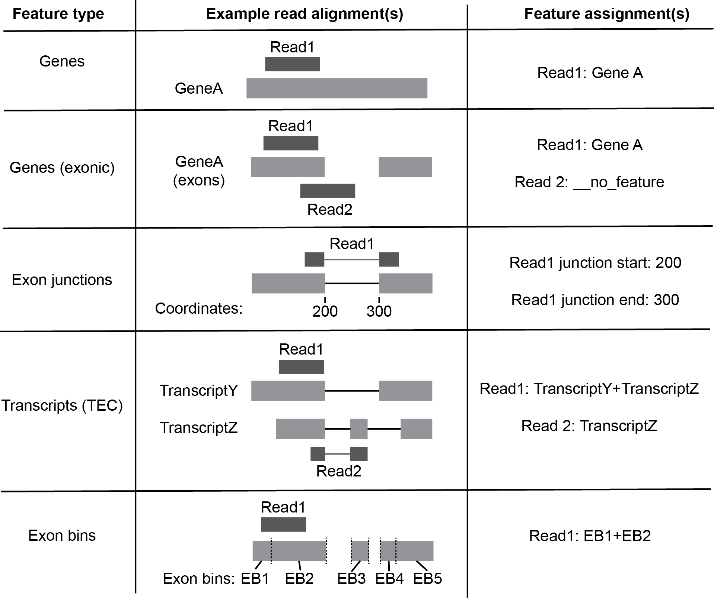
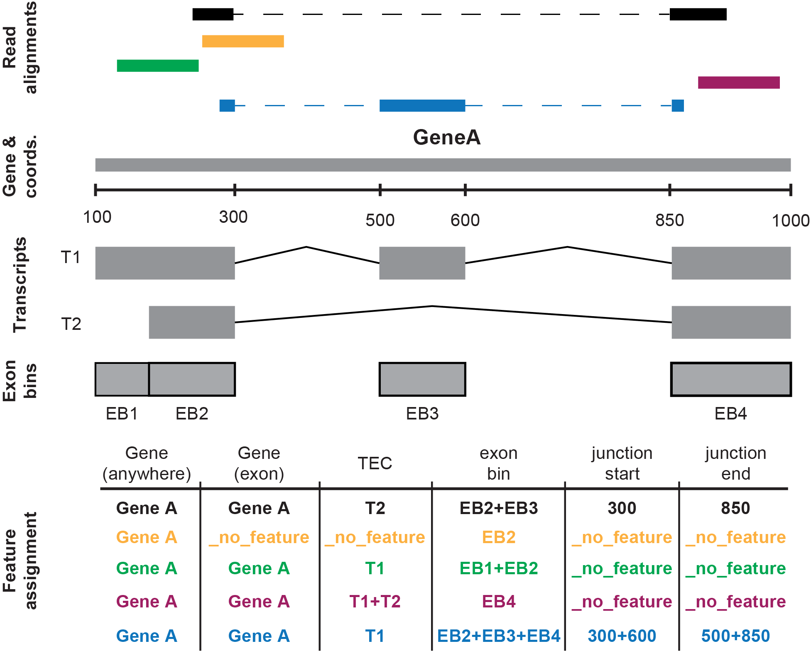

## Feature assignment

As documented elsewhere on this website, the real novelty of fastq2EZbakR is the broad array of genomic features to which reads can be assigned. The exhaustive list is:

1. Genes (anywhere)
1. Genes (exons only)
1. Exonic bins (as in DEXSeq)
1. Transcript equivalence classes (e.g., set of transcript isoforms with which a read is fully compatible)
1. Exon-exon junctions (From transcriptome alignment with STAR)
1. Exon-exon junctions (generalized but experimental; use with caution for now. More details below)
1. Exon-intron junctions (experimental; use with caution for now. More details below)

What follows is details regarding the nuance of each of these strategies, and suggestions as to how to most effectively use them:

### Summary

1. Genes (exons only) uses featureCounts and its `--nonOverlap` parameter (documentation [here](https://subread.sourceforge.net/SubreadUsersGuide.pdf)) to find reads that only overlap exonic regions of a gene. This has a minor limitation discussed [here](https://support.bioconductor.org/p/9157388/#9158726) that soft-clipped bases are counted as "non-overlapping". Thus, you will either have to use a sufficiently lenient `--nonOverlap` parameter to avoid not assigning soft-clipped reads, or alter alignment parameters to avoid soft-clipping (e.g., in STAR this means setting `--alignEndsType EndToEnd`).
1. Transcript equivalence class assignment uses a custom Python script that parses the transcriptome aligned bam file produced by STAR. If your annotation includes genes on different strands that partially overlap, transcripts from both of these genes can be improperly included by this
assignment strategy. [EZbakR](https://github.com/isaacvock/EZbakR), the tool most likely being used in conjunction with this strategy, can be provided a table of gene-to-transcript assignments to filter out such misassignments. In particular, see the `EstimateIsoformFractions()` function's `gene_to_transcript` parameter.
1. Exonic bins assignment uses featureCounts, and will assign reads to exonic bins even if a part of the read overlaps with purely intronic regions of a gene. Thus, this is best paired with either Genes (exons only) assignment or Transcript equivalence class assignment, so that reads form pre-RNA can be filtered out as necessary.
1. There are two exon-exon junction assignment strategies, one under the name `junctions` in the config.yaml file, and the other under the name `eej`. The former is only compatible with bam files produced by STAR containing the custom jI and jM tags. The latter is a less accurate, and still experimental option using featureCounts that is compatible with any bam file.
1. The exon-intron junction assignment strategy, like `eej`, is stil experimental. Both `eej` and `eij` involve creating a custom annotation with new junction features within a small window around each junction. featureCounts only assesses read nucleotide overlap with a given feature though, so you can run into instances where a read doesn't actually overlap with the junction, it just overlaps with a small portion of the junction window defined in the custom annotation. The accuracy of assignments by these two strategies can be bolstered by combining them with transcript equivalence class assignment (to filter out purely exonic reads that are misassigned to an exon-intron junction) and the always present sj column of the final cB, which tracks whether or not a gap existed in the reads alignment (e.g., orthogonal evidence for any exon-exon junction assignments).
1. Several of the assignment strategies can see a read assigned to multiple features (e.g., a read overlapping multiple distinct exonic bins). In these cases, the relevant entry in the cB table will look like "featureID1+featureID2+...+featureIDN", where "featureIDi" is the name of the ith feature of the relevant type that the read was assigned to. Reads not assigned to any feature are given a string of "__no_feature".

### Figures to help

Below are two figures that schematize the non-experimental feature assignment strategies in fastq2EZbakR. 

Figure 1: Each of the canonical assignment strategies.

Figure 2: Example assignment of a set of reads to all canonical assignment strategies. Notes: 1) coords. is short for "genomic coordinates"; 2) dotted line in read alignment section denotes gaps in alignment (in this case, all instances represent splice junction mapping reads).

