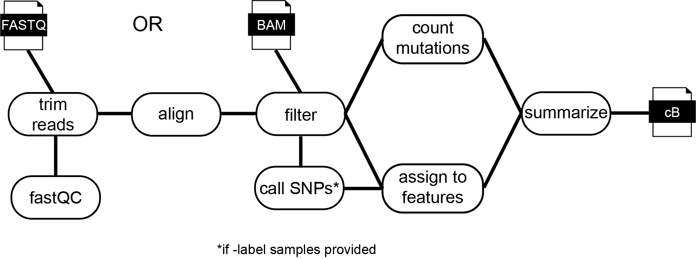

# Welcome to fastq2EZbakR!

fastq2EZbakR is a Snakemake pipeline designed to process nucleotide recoding RNA-seq data (NR-seq, e.g., [TimeLapse-seq](https://www.nature.com/articles/nmeth.4582), [SLAM-seq](https://www.nature.com/articles/nmeth.4435), [TUC-seq](https://pubmed.ncbi.nlm.nih.gov/31768978/), etc.). fastq2EZbakR provides output readily compatible with [EZbakR](https://github.com/isaacvock/EZbakR), but is also designed to provide processed NR-seq data in a convenient form that you can work with as you see fit.

## Where to go

Step 0: Checkout the rest of the information on this page to get a sense of fastq2EZbakR's functionality and use cases.

Step 1: Read the [Deployment](deploy.md) documentation to get up and running with fastq2EZbakR, or the [Slurm](slurm.md) documentation for deploying fastq2EZbakR on an HPC system with a slurm scheduler (e.g., Yale's HPC).

Step 2: Read the [Configuration](configuration.md) documentation to get details about all config parameters.

Stpe 3: Read about fastq2EZbakR's [generalized feature assignment](features.md), one of the major benefits of using fastq2EZbakR.

Step 4: Read the [Tips and Tricks](tips.md) documentation for helpful pointers that may make your life easier.

Step 5: Read about [Output](output.md) produced by fastq2EZbakR.

Step 6: Check out ancillary documentation about creating [tracks](tracks.md) and [FAQs](faq.md).

## What fastq2EZbakR does

The input to fastq2EZbakR is either FASTQ files or aligned BAM files (the latter must have the not-always-standard MD tag). The main output of fastq2EZbakR is a so-called cB (counts binomial) file that will always include the following columns:

* sample - Sample name
* rname - Chromosome name
* sj - Logical: TRUE if read contains exon-exon spliced junction
* n - Number of reads which have the identical set of values described above

In addition, columns reporting mutation counts and nucleotide counts will be included. For a standard NR-seq dataset (s4U labeling), that means tracking T-to-C mutation counts (column name: TC) and the number of reference Ts covered by a read (column name: nT). Finally, reads will be assigned to a set of annotated features, and columns will be included based on which of these feature assignment strategies you have activated in your particular pipeline run. The possibilities include:

* GF: gene read was assigned to (any region of gene)
* XF: gene read was assigned to (only exonic regions of gene)
* exonic_bin: exonic bins as defined in DEXSeq paper
* transcripts: set of transcripts a read is compatible with (i.e, its transcript equivalence class)
* junction_start: 5' splice site of exon-exon junction (genomic coordinate)
* junction_end: 3' splice site of exon-exon junction (genomic coordinate)
* ei_junction_id: Numerical ID given to a given exon-intron junction
* ee_junction_id: Numerical ID given to a given exon-exon junction

See [Configuration](configuration.md) and [Feature Assignment](features.md) for details about feature assignment strategies and how to select which to use.

### Advantages of fastq2EZbakR

fastq2EZbakR provides a number of unique functionalites not found in other established NR-seq data processing tools. These include:

1. Flexible assignment of reads to [genomic features](features.md).
1. Quantification of any mutation type you are interested in. T-to-C mutation counting is the most common NR-seq application, but any combination of mutation types are fair game. 
1. A [tidy](https://vita.had.co.nz/papers/tidy-data.pdf), easy to work with representation of your mutational data in the form of the aforementioned cB file.
1. Optional site-specific mutation counting (as was used [here](https://acs.figshare.com/collections/Disulfide_Tethering_to_Map_Small_Molecule_Binding_Sites_Transcriptome-wide/7421963) for example). Has allowed fastq2EZbakR to support processing of non-NR-seq mutational probing RNA-seq datasets.
1. Optional automatic downloading and processing of published data available on the [Sequence Read Archive (SRA)](https://www.ncbi.nlm.nih.gov/sra/docs/).

### The pipeline

Below is a simplfied schematic of the major steps performed by the fastq2EZbakR. 

It can take either FASTQ files or BAM files as input. If FASTQ files are provided, the following steps are run:

1. [fastQC](https://www.bioinformatics.babraham.ac.uk/projects/fastqc/) is run on each FASTQ file to generate QC reports. 
1. Adapters are trimmed with [fastp](https://github.com/OpenGene/fastp). This can be turned off (e.g., if you already did this before running fastq2EZbakR) by setting the `skip_trimming` parameter in your config.yaml file to `True`. If you have paired end data, adapters can be automatically detected. If not, or if you don't want to rely on automatic detection, you can specify adapters in the `fastp_adapters` parameter of the config.yaml file.
1. An alignment index is built (if the path specified in the `indices` parameter of the config doesn't already exist) using your provided genome FASTA file and annotation GTF file.
1. Reads are aligned with your choice of aligner (currently [STAR](https://github.com/alexdobin/STAR) and [HISAT2](https://github.com/DaehwanKimLab/hisat2) are implemented, but currently only the use of STAR supports all possible feature assignment strategies. Specify your choice in the `aligner` parameter of the config.yaml file).

The following steps will run in either the FASTQ or BAM file input cases: 

1. BAM files are filtered and sorted by read name. The former removes unaligned reads and non-primary alignments. The latter is important for parallelization of mutation counting, and is required by the feature assignment scripts.
1. If you have -label control samples (e.g., -s4U control samples in a standard NR-seq experiment), these can be used to call SNPs. These will be used to avoid false positive mutation counts.
1. Reads are assigned to feature, either using featureCounts or custom scripting. See [Feature Assignment](features.md) for details of what feature assignment strategies exist. You can choose which ones to implement in a particular pipeline run under the `features` parameter in the config.yaml file.
1. Mutations are counted with some custom scripting. All mutation types are tallied in the intermediate files created in the `results/counts` directory created by running fastq2EZbakR. You can specify which to include in the final processed cB file in the `mut_tracks` parameter in your config.yaml file.
1. Feature assignment and mutation counts are merged.
1. Colored sequencing tracks are created with STAR and IGVtools.
1. The final cB file is created.

## fastq2EZbakR's (brief) origin story

fastq2EZbakR is a rewrite of the original [TimeLapse-seq pipeline](https://bitbucket.org/mattsimon9/timelapse_pipeline/src/master/) developed by the [Simon lab](https://simonlab.yale.edu/) at Yale. The contributors to the original pipeline were Matthew Simon, Jeremy Schofield, Martin Machyna, Lea Kiefer, and Joshua Zimmer. A lot has changed since the initial creation of the pipeline, and fastq2EZbakR (developed by Isaac Vock) has a load of novel functionality. It is also an extension/rewrite of bam2bakR (also developed by Isaac), doing pretty much everything it does and then some.
